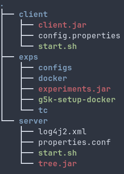

This repository contains all the experimental setup and scripts
used in the Arboreal paper.

#### Repository organization
This repository is organized as follows:
- The folder *deploy/tc* contains
  - The three scenarios used in the paper (nodes_*.txt) along with the resulting latencies between
    each pair of nodes (latencies_*.txt)
  - The scripts used inside each container to set up the TC rules, adding latency between nodes (setupTc*)
  - The IP addresses used for nodes and clients in the experiments (*Ips.txt)

- Each package (except the *utils* package) in the *src/main/kotlin* folder contains the code for a specific experiment in the paper. 
- The folder *deploy/configs* contains all configuration files, including:
  - A configuration file for each experiment, with the parameters used in the paper.
  - A configuration file for each of the three deployment scenarios used in the paper (tc_*.yaml)
  - Deployment-specific configuration for experiments with Arboreal (docker_config.yaml) and Cassandra (cass_docker_config.yaml)

#### Requirements
These scripts assume that:
- You are using a cluster of machines based on OAR (https://oar.imag.fr/), such as Grid5000 (https://www.grid5000.fr/).
- The docker engine is configured to allow TCP connections on port 2376 (the script *g5k-setup-docker* will set this up on Grid5000)
- (Optional) The machines in the cluster use a shared filesystem, such as NFS, to share the data between them.

#### Setup
- Copy the *"deploy"* folder from the Arboreal repository (https://github.com/pfouto/edge-tree) to the shared filesystem,
or alternatively, to each machine in the cluster.
- Copy the *"deploy"* folder from the Arboreal's client repository (https://github.com/pfouto/edge-client) to the shared filesystem,
or alternatively, to each machine in the cluster. Use a different folder than the one used for the Arboreal code.
- Clone this repository, and, in the folder *"deploy"*, build the required docker images:
  - Run `docker build  -t tc:0.1 . && docker save tc:0.1 -o tc.tar` to build the image used for both the client and the server of Arboreal, and save it to a tar file.
  - Run `docker build -f cassandra_tc.Dockerfile  -t cass_tc:0.1 . && docker save cass_tc:0.1 -o cass_tc.tar` to build the image used for the Cassandra nodes, and save it to a tar file.

- Copy the *"deploy"* folder (which now includes the .tar files) to the shared filesystem,
or alternatively, to each machine in the cluster. Use a different folder than the one used for the two previous ones.

The file structure in the cluster machines should look like this:

- Finally, open the docker configuration files (docker_config.yaml and cass_docker_config.yaml) and change the paths to match your file structure:
  - *imageLoc* should point to the location of the .tar files (tc.tar in the case of docker_config.yaml, and cass_tc.tar in the case of cass_docker_config.yaml).
  - *tcFolder* should point to the location of the folder *tc* that is in this repository.
  - *serverFolder* should point to the folder with the Arboreal code.
  - *clientFolder* should point to the folder with the Arboreal client code.
  - *logsFolder* is the path were the logs will be collected to after each experiment

For example, assuming that you have a folder *arboreal* in you home, with the contents as show in the previous figure, the paths should be:
  - imageLoc: /home/XXX/arboreal/exps/docker/(cass_)tc.tar
  - tcFolder: /home/XXX/arboreal/exps/tc
  - serverFolder: /home/XXX/arboreal/exps/server
  - clientFolder: /home/XXX/arboreal/exps/client
  - logsFolder: Anything works here. For example, /home/XXX/arboreal/logs

Apart from the logs folder, these folders will be mounted inside the containers, so they must be accessible from every machine in the cluster.

#### Running
To run each experiment, simply edit the configuration file to match the desired parameters, and run the experiments.jar file that is inside the exps folder with the configuration file as argument. For instance:
- `java -jar experiments.jar run --config configs/exps_micro_test.yaml`

The script will create a docker swarm, overlay network, and containers for nodes as clients, splitting them across the machines as specified in the docker configuration file.

It will then run an experiment for every configuration in the file, and collect the logs in the logs folder, inside a subfolder with the name of the experience (which is defined in the experience configuration file).
